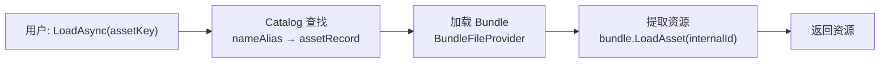
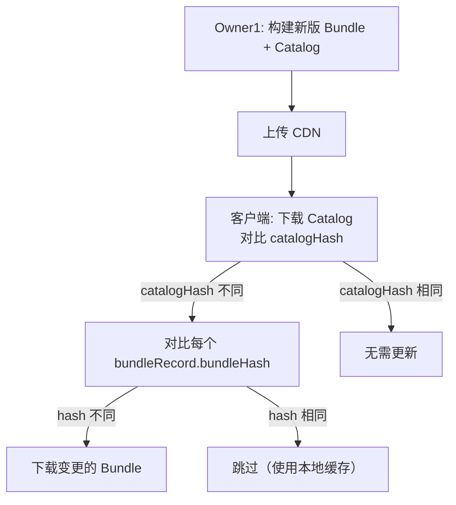
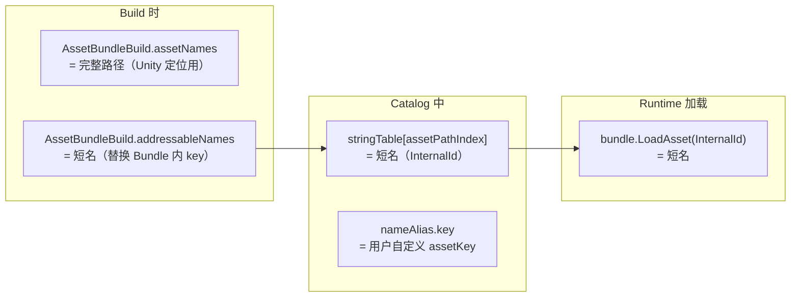

# SBP vs 传统 BuildPipeline 技术选型分析

## 已确认的业务需求

- **HyperContent 将完全替代 Addressables**：不需要兼容 SBP 构建的 Bundle
- **用户通过 key 加载**：运行时不需要知道 Bundle 内部路径，`assetPathIndex` 是纯内部实现
- **需要支持资源热更新**：客户端通过 catalogHash/bundleHash 检测变更，增量下载

## 1. 端到端加载流程



关键：`internalId` = `stringTable[assetPathIndex]`，这个值取决于构建时写入 Bundle 的 key。

- **传统 BuildPipeline + addressableNames**：`internalId` = `assetKey`（短名，如 `"Assembly_Hotfix.dll.bytes"`）
- **SBP**：`internalId` = 完整路径（如 `"Assets/Addressables/Misc/Assembly_Hotfix.dll.bytes"`）

用户调用的 key 和 Bundle 内部的 key 是解耦的，Catalog 负责翻译。

## 2. 测试数据

测试对象：Addressables（SBP）构建的 `misc_assets_all.bundle`

| LoadAsset Key | 结果 |
|---|---|
| 完整路径（原始大小写）`Assets/Addressables/Misc/Assembly_Hotfix.dll.bytes` | SUCCESS |
| 短名 `Assembly_Hotfix.dll` | FAILED |
| 文件名 `Assembly_Hotfix.dll.bytes` | FAILED |
| 全小写路径 | FAILED |

SBP Bundle 只接受精确完整路径。传统 BuildPipeline 的 `addressableNames` 行为**尚需验证**（见待验证项）。

## 3. 热更新影响分析

热更新流程与 Build Pipeline 选择**无关**，两者产出的都是标准 Unity AssetBundle：



唯一与构建管线相关的热更考量：**构建确定性**。

- 传统 BuildPipeline：加 `DeterministicAssetBundle` flag 可获得确定性输出
- SBP：默认确定性更好

如果构建不确定，同样的资源可能产出不同的 bundleHash → 客户端误判需要更新 → 浪费带宽。
传统管线通过 `BuildAssetBundleOptions.DeterministicAssetBundle` 可以解决此问题。

## 4. 三条路线对比

### 路线 A：传统 BuildPipeline + addressableNames（现有实现）

`DefaultBuildExecutor.cs` 已实现：`AssetBundleBuild.addressableNames = Path.GetFileNameWithoutExtension(assetPath)`（资源名不带后缀）

> 注：原 `BundleBuilder.cs` 逻辑已整合到 `DefaultBuildExecutor.cs`，`BundleBuilder.cs` 已删除。

优势：
- **Catalog 更小**：`assetPathIndex` 存短 key，50k 资源节省约 5 MB string 内存
- **GC 更少**：Initialize 反序列化分配减少 ~5 MB
- **热更友好**：Catalog JSON 更小 → 下载更快；加 `DeterministicAssetBundle` 保证构建确定性
- **已实现**：`DefaultBuildExecutor.cs` 代码已就绪
- **替代 Addressables 无阻碍**：不需要兼容 SBP Bundle

劣势：
- **无增量构建**：每次全量 build
- **无 Build Cache**：大项目构建耗时长
- **Unity 长期方向**：传统 API 不是 Unity 主推方向（但短期内不会移除）

### 路线 B：SBP ContentPipeline

优势：
- **增量构建**：后续构建快很多
- **Build Cache**：中间产物复用
- **确定性更好**：默认确定性输出

劣势：
- **必须存完整路径**：`assetPathIndex` 存长路径，Catalog 更大 + GC 更多
- **API 复杂**：需要重写 `BundleBuilder.cs`
- **违背 Catalog 设计目标**：我们设计 stringTable + index 就是为了减少 GC

### 路线 C：SBP CompatibilityBuildPipeline（最优方案）

API 兼容传统管线但走 SBP 引擎。**SBP 2.4.3 官方文档 "Load By File Name Example" 已确认 `addressableNames` 在此模式下生效**（[Usage Examples](https://docs.unity3d.com/Packages/com.unity.scriptablebuildpipeline@2.4/manual/UsageExamples.html)）。

```csharp
// SBP 官方示例
var bundles = ContentBuildInterface.GenerateAssetBundleBuilds();
for (var i = 0; i < bundles.Length; i++)
    bundles[i].addressableNames = bundles[i].assetNames.Select(Path.GetFileNameWithoutExtension).ToArray();
var manifest = CompatibilityBuildPipeline.BuildAssetBundles(outputPath, bundles, options, buildTarget);
```

优势（集两家之长）：
- **addressableNames 短名加载**：Catalog 存短 key，体积小、GC 少（同路线 A）
- **Build Cache + 增量构建**：后续构建显著更快（同路线 B）
- **API 改动极小**：只需把 `BuildPipeline` 替换为 `CompatibilityBuildPipeline`，加一个 `using`
- **确定性构建**：SBP 默认确定性输出
- **Unity 推荐方向**：SBP 是官方主推管线

劣势：
- 不支持按 Bundle 单独压缩（需要路线 B 的 `ContentPipeline` API 才行）
- 不支持 `ContiguousBundles`、`NonRecursiveDependencies` 等 SBP 高级参数
- 需要实际验证 `LoadAsset(addressableName)` 在产出的 Bundle 上确实能成功

## 5. 构建参数对比

### 5.1 API 调用方式

**路线 A（传统 BuildPipeline）**：

```csharp
AssetBundleBuild build = new AssetBundleBuild
{
    assetBundleName = "ui_common",
    assetNames = new[] { "Assets/UI/AvatarWidget.prefab" },   // 完整路径（Unity 内部用）
    addressableNames = new[] { "AvatarWidget" }               // 短名（LoadAsset 备选 key）
};
BuildPipeline.BuildAssetBundles(outputPath, builds, options, buildTarget);
```

**路线 B（SBP ContentPipeline）**：

```csharp
// BundleBuildContent 无独立 API 文档页，但存在于 UnityEditor.Build.Pipeline 命名空间
// 官方示例：new BundleBuildContent(ContentBuildInterface.GenerateAssetBundleBuilds())
var buildContent = new BundleBuildContent(bundleDefinitions);  // 接受 AssetBundleBuild[]，但不走 addressableNames
var buildParams = new BundleBuildParameters(buildTarget, buildTargetGroup, outputPath);
buildParams.UseCache = true;
buildParams.ContiguousBundles = true;
buildParams.NonRecursiveDependencies = true;
ContentPipeline.BuildAssetBundles(buildParams, buildContent, out IBundleBuildResults results);
```

**路线 C（CompatibilityBuildPipeline）**：

```csharp
// API 签名与传统相同，内部走 SBP 管线
CompatibilityBuildPipeline.BuildAssetBundles(outputPath, builds, options, buildTarget);
```

### 5.2 构建选项（Options / Parameters）

| 参数 | 路线 A（传统） | 路线 B（SBP） | 路线 C（兼容层） | 说明 |
|---|---|---|---|---|
| **压缩方式** | `BuildAssetBundleOptions` flag | `BundleBuildParameters.GetCompressionForIdentifier()` | 同路线 A | SBP 可按 Bundle 单独设压缩；传统只能全局统一 |
| **LZ4** | `ChunkBasedCompression` | `BuildCompression.LZ4` | `ChunkBasedCompression` | 推荐：加载快，体积适中 |
| **LZMA** | 默认（None flag） | `BuildCompression.LZMA` | 默认 | 体积最小但需要完整解压 |
| **无压缩** | `UncompressedAssetBundle` | `BuildCompression.Uncompressed` | `UncompressedAssetBundle` | 开发调试用 |
| **确定性构建** | `DeterministicAssetBundle`（Unity 2023+ 始终启用） | 默认启用 | 默认启用 | 相同输入产出相同 hash，热更必需 |
| **强制重建** | `ForceRebuildAssetBundle` | `UseCache = false` | `ForceRebuildAssetBundle` | 忽略缓存全量重建 |
| **Build Cache** | 不支持 | `UseCache = true`（默认） | 通过 SBP 引擎支持 | 增量构建核心，跨构建复用中间产物 |
| **追加 Hash 到文件名** | `AppendHashToAssetBundleName` | `AppendHash = true` | `AppendHashToAssetBundleName` | CDN 缓存失效策略 |
| **禁用 TypeTree** | `DisableWriteTypeTree` | `ContentBuildFlags.DisableWriteTypeTree` | `DisableWriteTypeTree` | 减小 Bundle 体积约 10-20%，但牺牲跨版本兼容性 |
| **严格模式** | `StrictMode` | 默认严格 | `StrictMode` | 任何错误导致构建失败 |
| **连续 Bundle 布局** | 不支持 | `ContiguousBundles = true` | 不支持 | 优化磁盘读取，资源在 Bundle 文件中连续排列 |
| **非递归依赖** | 不支持 | `NonRecursiveDependencies = true` | 不支持 | 减少不必要的 Bundle 重建和运行时内存 |
| **输出 link.xml** | 不支持 | `WriteLinkXML = true` | 不支持 | 配合 IL2CPP 代码裁剪 |
| **按 Bundle 单独压缩** | 不支持（全局统一） | 支持（重写 `GetCompressionForIdentifier`） | 不支持 | 如：音频 Bundle 无压缩，UI Bundle 用 LZ4 |
| **addressableNames** | 支持 | 不支持（只认完整路径） | 支持（官方文档确认） | 短名加载的关键 |
| **DryRun 测试构建** | `DryRunBuild` | 不支持 | `DryRunBuild` | 不生成文件，只验证 |

### 5.3 对热更的关键参数

| 参数 | 影响 | 推荐值 |
|---|---|---|
| 确定性构建 | 相同资源产出相同 bundleHash，避免客户端误下载 | 启用（Unity 2023+ 默认启用） |
| LZ4 压缩 | 加载快 + 体积适中，支持随机访问（无需完整解压） | 推荐 |
| AppendHash | Bundle 文件名含 hash，CDN 天然缓存失效 | 可选（HyperContent 通过 Catalog bundleHash 管理） |
| DisableTypeTree | 减小体积 ~15%，但 Bundle 只能被相同 Unity 版本加载 | 需慎重，热更场景下建议保留 TypeTree |

### 5.4 HyperContent 推荐参数配置（路线 C）

```csharp
using UnityEditor.Build.Pipeline; // SBP 命名空间

var options = BuildAssetBundleOptions.ChunkBasedCompression    // LZ4 压缩
            | BuildAssetBundleOptions.StrictMode                // 严格模式
            | BuildAssetBundleOptions.DeterministicAssetBundle; // 确定性（2023+ 默认）
// 不加 DisableWriteTypeTree —— 热更需要 TypeTree 兼容性
// 不加 AppendHashToAssetBundleName —— 由 Catalog bundleHash 管理版本

// 用 CompatibilityBuildPipeline 替代 BuildPipeline（仅此一处改动）
var manifest = CompatibilityBuildPipeline.BuildAssetBundles(outputPath, builds, options, buildTarget);
```

## 6. 综合对比总结

| 维度 | 路线 A（传统） | 路线 B（SBP 完整） | 路线 C（SBP 兼容层） |
|---|---|---|---|
| assetPathIndex 内容 | assetKey 短名 | 完整路径 | 可选短名或完整路径（当前选择：**完整路径**，见第 7 节） |
| 50k 资源 Catalog 内存 | ~2.4 MB | ~7.6 MB | 当前：~7.6 MB（完整路径），可优化至 ~2.4 MB |
| Initialize GC | ~2.4 MB | ~7.6 MB | 当前：~7.6 MB（完整路径），可优化至 ~2.4 MB |
| Catalog JSON 大小 | ~2.0 MB | ~4.5 MB | 当前：~4.5 MB（完整路径），可优化至 ~2.0 MB |
| 增量构建 | 不支持 | 支持 | **支持** |
| Build Cache | 不支持 | 支持 | **支持** |
| 构建确定性 | 需加 flag（2023+ 默认） | 默认支持 | **默认支持** |
| addressableNames 短名 | 支持 | 不支持 | **支持（官方文档确认）** |
| 按 Bundle 单独压缩 | 不支持 | 支持 | 不支持 |
| 连续 Bundle 布局 | 不支持 | 支持 | 不支持 |
| TypeTree 控制 | 支持 | 支持 | 支持 |
| 代码改动量 | 最小 | 重写 BundleBuilder | **极小（换一个类名 + using）** |
| 热更下载量 | Catalog 更小 | Catalog 更大 | **Catalog 更小** |

## 7. 当前选择（已确认）

### 7.1 Build 参数映射



### 7.2 具体示例

以 `Assets/Addressables/Misc/Assembly_Hotfix.dll.bytes` 为例：

| 字段 | 值 | 说明 |
|---|---|---|
| `AssetBundleBuild.assetNames` | `Assets/Addressables/Misc/Assembly_Hotfix.dll.bytes` | Unity 构建时定位资源文件，必须是完整路径 |
| `AssetBundleBuild.addressableNames` | `Assembly_Hotfix.dll` | 短名（`GetFileNameWithoutExtension`），**替换 Bundle 内部 key** |
| Catalog `stringTable[assetPathIndex]` | `Assembly_Hotfix.dll` | 即 `ResourceLocation.InternalId`，与 `addressableNames` 一致 |
| Catalog `nameAlias` key | 用户自定义（如 `"Assembly_Hotfix.dll.bytes"`） | 用户调用 `LoadAsync(key)` 时的 key |
| Runtime `bundle.LoadAsset()` 参数 | `Assembly_Hotfix.dll` | 使用 InternalId（短名），匹配 `addressableNames` |

### 7.3 设计理由

- **InternalId 使用短名**：Unity 文档明确指出设置 `addressableNames` 后，原始 `assetNames` 路径不再可用于 `LoadAsset`，Bundle 内部 key 被 `addressableNames` 完全替换。实测确认：完整路径 FAILED，短名 SUCCESS。
- **addressableNames = `GetFileNameWithoutExtension(assetPath)`**：构建时设置短名替换 Bundle 内部 key，运行时通过 InternalId（同一短名）直接命中，零 fallback。
- **Catalog 体积优化**：短名（如 `Assembly_Hotfix.dll`）vs 完整路径（如 `Assets/Addressables/Misc/Assembly_Hotfix.dll.bytes`），50k 资源约节省 ~5 MB string 内存和 GC，符合 Catalog 设计初衷。

## 8. Owner0 推荐（更新）

**推荐路线 C（SBP CompatibilityBuildPipeline），理由：**

1. **addressableNames 官方确认可用**：SBP 2.4.3 文档 "Load By File Name Example" 直接展示了此用法
2. **增量构建 + Build Cache**：大项目后续构建快很多（路线 A 不具备）
3. **确定性构建默认启用**：热更场景下更可靠
4. **代码改动极小**：`BundleBuilder.cs` 只需换一个类名 + 加一个 `using`
5. **InternalId = 短名（addressableNames）**：实测确认 `addressableNames` 完全替换 Bundle 内部 key，完整路径无法加载；短名同时实现 Catalog 体积最优

**演进路径**：

- ~~**当前**：路线 A（传统 BuildPipeline）+ InternalId 短名，已跑通端到端~~
- ~~**构建速度优化时**：切换至路线 C（CompatibilityBuildPipeline），验证 `addressableNames` 行为一致后替换~~
- ~~**如需按 Bundle 单独压缩**：实现 `SBPBuildExecutor`（IBuildExecutor 新实现），使用 `ContentPipeline` API~~
- ~~**如 CompatibilityBuildPipeline 有兼容问题**：回退到路线 A（改回一行代码）~~

> **2026-03-30 更新**：已跳过路线 C 兼容模式，直接切换到完整 SBP `ContentPipeline.BuildAssetBundles`（自定义 task 列表）。主要动机：Bundle 间依赖必须从 SBP 的对象级分析（`IBundleBuildResults.BundleInfos`）获取 ground truth，`CompatibilityBuildPipeline` 不暴露此数据。当前实现同时获得了 Build Cache、确定性构建、精确依赖三大优势。

## 9. 实施前必须验证

**关键验证**（在写 CatalogGenerator 之前必须做）：

用 `CompatibilityBuildPipeline.BuildAssetBundles()` 构建一个测试 Bundle（设置 `addressableNames`），然后验证：

1. `bundle.LoadAsset(fullPath)` 是否成功（InternalId 主路径）
2. `bundle.LoadAsset(addressableName)` 是否成功（备选短名）
3. `bundle.GetAllAssetNames()` 返回的内容是什么
4. 相同输入两次构建是否产出相同 bundleHash（确定性验证）

这四项验证通过后，路线 C 的所有假设都得到实证确认，可以正式实施。
如果验证失败，回退到路线 A（只改一行代码）。
