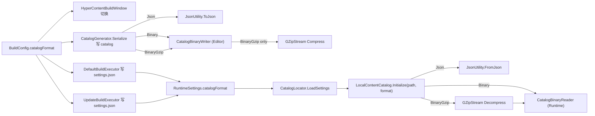

# HyperContent Catalog Schema

Catalog Layer design: how addresses are translated to locations, and the data formats involved. Refer to this document when building or parsing catalog files.

For architecture overview (all layers), see [ARCHITECTURE.md](ARCHITECTURE.md).
For runtime data flows, see [INITIALIZATION_FLOW.md](INITIALIZATION_FLOW.md), [LOAD_RELEASE_FLOW.md](LOAD_RELEASE_FLOW.md), [CONTENT_UPDATE_FLOW.md](CONTENT_UPDATE_FLOW.md), [PROVIDER_FLOW.md](PROVIDER_FLOW.md).
For conventions (naming, error codes, RefCount), see [CONVENTIONS.md](CONVENTIONS.md).
For Owner responsibilities, see [OWNERS.md](OWNERS.md).

---

## 1. Catalog Layer Overview

The Catalog Layer translates **addresses** (user-facing strings) into **ResourceLocations** (internal descriptors). This is the decoupling boundary that allows hot-update by swapping only the Catalog data.

### ICatalog Interface

```csharp
public interface ICatalog
{
    bool TryGetLocations(string address, Type type, out IList<ResourceLocation> locations);
    string Version { get; }
    bool IsValid { get; }
    bool Initialize(string source);
    void Release();
    bool TryGetBundleInfo(string bundleName, out BundleInfo bundleInfo);
    IEnumerable<string> GetAllBundleNames();
}
```

- `TryGetLocations`: Core method. Resolves address (GUID or Name) to ResourceLocation tree with full dependency chain.
- `TryGetBundleInfo` / `GetAllBundleNames`: Content management queries for Owner3 update pipeline.
- `Initialize` / `Release`: Lifecycle management. Initialize builds all internal lookup structures; failure prevents system startup.

### ResourceLocation

A Location fully describes where an asset is, how to load it, and what it depends on:

```csharp
public sealed class ResourceLocation
{
    public string Address { get; }                              // User-side address
    public string InternalId { get; }                           // Actual path or URL
    public string ProviderId { get; }                           // Routes to which Provider
    public Type ResourceType { get; }                           // Asset type
    public IReadOnlyList<ResourceLocation> Dependencies { get; } // Dependent Locations
    public object Data { get; }                                 // Extra data (CRC, Hash, size, etc.)
    public int LocationHash { get; }                            // Key for Operation cache
}
```

---

## 1.1 Serialization Formats（写入端 / 读取端对称）

`CatalogSchema` 在物理层面有 **三种** 可选序列化格式，由 `CatalogSerializationFormat` 枚举驱动：

| 值 | 名称 | 说明 | 文件特征 |
|----|------|------|----------|
| `0` | `Json` | `JsonUtility.ToJson` 文本格式，肉眼可读、便于 diff/排查 | 首字节 `{` |
| `1` | `Binary` | 手写紧凑二进制（HCB1），无压缩，**解析最快** | 首 4 字节 `HCB1` |
| `2` | `BinaryGzip` | HCB1 之上再过 `GZipStream` 压缩，**文件最小**（hot-update 流量友好） | 首 2 字节 `0x1F 0x8B`（GZip magic） |

> 扩展点：`CatalogSerializationFormat` 是开放枚举，未来加入 LZ4 / Zstd 等只需新增枚举值 + 在两端 dispatcher 增加 case，`CatalogBinaryReader` / `CatalogBinaryWriter` 主体无需变动。

### 写入端 / 读取端必须严格对称



| settings.catalogFormat | catalog 实际格式 | 行为 |
|---|---|---|
| Json | Json | OK |
| Binary | Binary | OK |
| BinaryGzip | BinaryGzip | OK |
| 任何不一致组合 | | 失败：`CATALOG_INVALID_FORMAT` |

`settings.json` 在 APK 出包时固化，**不通过 hot-update 更新** → 跨格式必须出新 APK。`HyperContentBuildWindow` 切换 catalog format 时会弹窗提示是否立刻 Full Build，避免出现 catalog 与 settings.json 中间过渡态。

### HCB1 二进制布局

> Reader/Writer 处理"未压缩"字节；BinaryGzip 在 dispatcher 层把这段字节再过一次 GZip。

| 偏移 | 字段 | 类型 | 说明 |
|------|------|------|------|
| 0 | magic | 4 bytes | ASCII `"HCB1"` (HyperContent Binary v1) — 完整性自检 |
| 4 | binaryFormatVersion | int32 LE | 当前为 `2`（v2 起 `assetRecords` 增加 `dependencyBundles`）；二进制布局变动时此值 +1 |
| 8 | schemaVersion | int32 LE | 同 `CatalogSchema.schemaVersion`（当前 `2`），按 `CurrentSchemaVersion` 校验 |
| ... | catalogNameIndex | int32 LE | |
| ... | catalogHash | string | length-prefixed UTF-8（int32 length + bytes） |
| ... | timestamp | int64 LE | |
| ... | stringTable | int32 count + N×(int32 len + UTF-8 bytes) | |
| ... | assetRecords | int32 count + N×(string guid, int32 bundleIndex, int32 assetPathIndex, **intList dependencyBundles**) | `dependencyBundles` 编码：`int32 count`（`-1` 表示 null）+ `int32×count` |
| ... | nameAliases | int32 count + N×(int32 nameStringIndex, string nameHash, int32 guidIndex) | |
| ... | bundleRecords | int32 count + N×(int32 bundleNameIndex, string bundleHash, int64 size, int32 depCount + int32×deps, int32 assetCount, int32 contentLocation, int32 bundleTagFlags, int32 remoteRelativePathIndex) | |

- **string 编码**：`int32 length`（-1 表示 null）+ UTF-8 字节。
- **数值统一 little-endian**（`BinaryWriter` / `BinaryReader` 默认）。
- **可扩展性**：
  - schema 字段增删 → bump `schemaVersion`，Reader 按版本分支。
  - 二进制布局变化（如改 varint）→ bump `binaryFormatVersion`，Reader 按版本分支。
  - 压缩算法 → 不影响 HCB1 格式本身，新增 `CatalogSerializationFormat` 值即可。
- **catalogHash 计算流程不变**：仍按"先序列化（hash=空）→ 写 hash 字段 → 再序列化"两轮 SHA256，无论目标格式是 Json / Binary / BinaryGzip（hash 是对 schema 内容的指纹，与外层封装格式无关）。

### 实测性能（2026-05-18 · Android · catalog ~8.7 MB JSON 体量）

> 数据来源：`LocalContentCatalog.Initialize` 接入 `IGGProfiler`（开 `ENABLE_PROFILERLOG`）后多次运行均值。关宏时变量声明 + 调用全部条件编译，零开销。

| Format | IO | Decompress | Deserialize | BuildLookup | Other (un-sampled) | **Total** | 文件大小 |
|---|---:|---:|---:|---:|---:|---:|---:|
| Json | 60 ms | — | 138 ms | 74 ms | ~340 ms | **612 ms** | 8740 KB |
| Binary | 27 ms | — | 36 ms | 74 ms | ~344 ms | **481 ms** | 3918 KB (-55%) |
| BinaryGzip | 6 ms | 28 ms | 32 ms | 74 ms | ~350 ms | **490 ms** | 1470 KB (-83%) |

**结论与选型**：
- Deserialize 阶段 Json → Binary 直接 **-74%**，是切换格式带来的最大、最确定收益。
- **本地命中 / 启动性能优先 → `Binary`**：Total 481 ms 最快，无解压抖动，文件比 Json 省 55%。
- **下载流量 / 包体优先 → `BinaryGzip`**：文件 1.44 MB 最小，Total 仅比 Binary 慢 ~9 ms；移动端弱 CPU + 慢 IO + 远端拉取场景下解压成本被放大的 IO 节省覆盖，综合优势更明显。
- `BuildLookup` 74 ms 跨格式完全一致 — 与序列化方式无关，是在内存 schema 之上建索引字典。
- "Other" ~345 ms 跨格式恒定、占 Total 70%，是 `CatalogLocator` / hash 校验 / Provider 注册 / HCLogger 同步 IO / 首次 JIT 等未被 sample 的部分。**下一波想再压 Initialize 总时间应该在这里下手，而不是继续抠序列化。**
- **真机复测待补**（中低端 Android），预期 `BinaryGzip` 综合优势进一步放大。

---

## 2. JSON Schema (CatalogSchema)

Catalog format with O(1) Dictionary-based lookup and minimal GC allocation. Supports both GUID and Name-based asset resolution.

**Owner**: Owner0 defines the schema (`CatalogSchema.cs`); Owner1 implements the build-time generation (`CatalogGenerator.cs`).

### 2.1 Design Goals

- **Zero-allocation lookup**: Index-based access into stringTable; Dictionary structures built once at Initialize
- **Dual key support**: Both GUID (32-char hex) and Name (human-readable, e.g. "Widget/AvatarWidget.prefab") can be used as load keys
- **Incremental update**: catalogHash and contentHash (bundleHash) enable delta updates without full re-download
- **Zero runtime hash computation**: Name lookup uses Dictionary keyed by original name string, no SHA256 at runtime

### 2.2 Top-Level Fields

| Field | Type | Description |
|-------|------|-------------|
| `schemaVersion` | int | **Required.** Must equal `CatalogSchema.CurrentSchemaVersion` in code. Runtime loads **only** this version; any other value fails `LocalContentCatalog.Initialize` with `ErrorCode.CATALOG_VERSION_MISMATCH` (no fallback to older layouts). Bump `CurrentSchemaVersion` only with a coordinated rebuild/republish of all catalogs. |
| `catalogNameIndex` | int | Index into `stringTable` for catalog identity name |
| `catalogHash` | string | SHA256 of the full catalog JSON (64-char lowercase hex), for hot-update detection |
| `timestamp` | long | Build timestamp |
| `stringTable[]` | string[] | Shared string pool, all strings referenced by index |
| `assetRecords[]` | AssetRecordEntry[] | Asset record array |
| `nameAliases[]` | NameAliasEntry[] | Name-to-GUID alias table |
| `bundleRecords[]` | BundleRecordEntry[] | Bundle metadata array |

### 2.3 String Table

- **stringTable[]** stores all reusable strings (bundleName, assetPath, Name aliases, catalogName, etc.)
- All other structures reference strings by **index** into this table, avoiding runtime GC

### 2.4 AssetRecord

| Field | Type | Description |
|-------|------|-------------|
| `guid` | string | Asset GUID (32 lowercase hex chars) |
| `bundleIndex` | int | Index into `bundleRecords` (the asset's **owning** bundle) |
| `assetPathIndex` | int | Index into `stringTable` for asset path inside bundle |
| `dependencyBundles` | int[] | **(schema v2+)** Asset-level dependency bundle indices into `bundleRecords` — the minimal, self-contained set needed to load **this** asset, computed at build time from SBP object-level dependency data. Pipeline: (1) one-hop entry bundles from `IBundleWriteData.AssetToFiles` + `FileToBundle`, taken over the asset's **in-bundle entry frontier** (the asset plus every sibling entry it transitively references within the same owning bundle, from `IDependencyData.referencedObjects`); (2) the SBP-invisible `SpriteAtlas` edge (see [2.4.1](#241-spriteatlas-dependency-recovery)); (3) transitive expansion through the SBP bundle-level closure (`BundleDependencies`), which recovers multi-hop explicit chains like `prefab → material → shader`; (4) a clamp to the owning bundle's bundle-level closure (`AssetLevel ⊆ BundleLevel`). **Ordered with the owning bundle LAST**, so `BundleAssetExtractor` takes the last entry as the primary bundle. `null`/empty means the catalog carries no asset-level data for this asset. |

#### Asset-level vs Bundle-level loading (`DependencyLoadMode`)

`dependencyBundles` powers **asset-level** dependency loading: when loading asset `a`, the runtime loads only `a`'s owning bundle plus `a`'s real dependency bundles — not the owning bundle's full transitive bundle-level closure. The active strategy is a global, build-time-fixed switch `DependencyLoadMode` (`Runtime/Core/RuntimeSettings.cs`), baked into `settings.json` as `dependencyLoadMode` (`0` = `AssetLevel`, `1` = `BundleLevel`):

| Mode | Behavior | Cache used |
|------|----------|------------|
| `AssetLevel` (default) | Load only this asset's `dependencyBundles`. Missing asset-level data → load **fails** with `ErrorCode.CATALOG_ASSET_DEPS_MISSING` (no silent bundle-level fallback). | `_assetFlatDepsCache` |
| `BundleLevel` | Legacy behavior: load the owning bundle's full transitive closure (`bundleRecords[].dependencies`). Global rollback / A-B. | `_bundleFlatDepsCache` |

`settings.json` is fixed for the app lifetime (not changed by hot-update), so a reloaded catalog keeps the same mode (see `HyperContentImpl.TryReplaceRuntimeCatalog`). Editor `UseAssetDatabase` play mode bypasses bundles entirely and is unaffected.

> **Diagnostic subset check:** the build runs `DefaultBuildExecutor.ValidateAssetDepsSubsetOfBundleClosure`, which verifies each asset's `dependencyBundles` (minus the owning bundle) is a subset of its owning bundle's SBP bundle-level closure. Violations are logged at Error level **without blocking the build** (the decision was diagnostic-only). The `build_report.json` `assetLevelDiff` section quantifies how many bundles asset-level loading avoids vs bundle-level. Use the Inspector "Deps" tab (`HyperContentDiagnostics.TryQueryDependencyBundles`) to query, per address, the bundle set actually resolved under the live mode.

#### 2.4.1 SpriteAtlas dependency recovery

A prefab whose UI references a `Sprite` packed into a `SpriteAtlas` is the canonical case where SBP's **per-asset** dependency data is incomplete, and it must be handled explicitly or the sprite renders as a **white / missing image** at runtime.

**Why it happens.** The prefab serializes a `PPtr` to the source `Sprite`; once that sprite is packed into an atlas, the "sprite → atlas texture" link is a **runtime late binding** (Unity's `SpriteAtlas` registers and redirects at load time). SBP's two dependency sources treat this differently:

| Source | Granularity | When computed | Captures the atlas edge? |
|--------|-------------|---------------|--------------------------|
| `IBundleWriteData.AssetToFiles[guid]` | per-asset | early dependency-calc pass | **No** — follows the `Sprite` PPtr but does not fold in the late-bound atlas write file |
| `IBundleBuildResults.BundleInfos[bundle].Dependencies` | per-bundle | after archive/write | **Yes** — atlas packing is resolved by then, so the bundle→atlas edge exists |

So `AssetLevel` mode (built from `AssetToFiles`) **misses** the atlas, while `BundleLevel` mode (built from `BundleInfos.Dependencies`) does not. Note that `BundleLevel` "working" can also be partly incidental: a shared atlas is often kept resident by *other* loaded assets' broad closures (`OperationCache` shares bundle ops by `LocationHash` with refcounting), which can mask a genuinely-missing per-bundle edge. Either way, the robust fix is to make the dependency **explicit at the asset level**.

**The recovery (`DefaultBuildExecutor`).** During `BuildAssetDependencyBundlesFromSbp`, `AddPackedSpriteAtlasBundles` walks `AssetDatabase.GetDependencies(asset, true)` and recovers **only** the indirect `SpriteAtlas` edge: a dependency that is a source **texture packed into an atlas**. `GetDependencies` returns the source texture (not the atlas), so it is resolved through a build-time reverse map `BuildSpriteSourceToAtlasMap()` (source texture GUID → owning atlas GUID, expanded from every `SpriteAtlas.GetPackables()`, folders included), then the atlas's bundle is added to the base set (before transitive expansion, so the atlas's own closure expands too).

This is the **only** edge recovered from `AssetDatabase`, because it is the only one SBP genuinely cannot see. Ordinary multi-hop explicit chains (e.g. `prefab → material(entry) → shader(entry)`) are **not** recovered here — they are handled by the caller's transitive expansion over `BundleDependencies` (which is already a transitive closure), which is precise and avoids the over-pin of a recursive `AssetDatabase` walk.

The owning-bundle-LAST order is preserved (only non-owning bundles are inserted). Implicit deps that SBP duplicates into the owning bundle correctly never appear in `AssetToBundle` and need no edge.

#### 2.4.2 In-bundle entry frontier (same-bundle sibling recovery)

`AssetToFiles` is **one-hop**: it stops at explicit (entry) asset boundaries. This is fine when the intermediate entry lives in a *different* bundle — the transitive expansion over `BundleDependencies` recovers it. But when an entry `R` references a **sibling entry `Y` in the SAME owning bundle**, and `Y` has cross-bundle deps (`R → Y(sibling entry) → M(other bundle)`), `Y`'s bundle equals the owner, which the expansion excludes — so `M` is missed. (Canonical case: `Boundary` holds `groundPrefabList`/`boundaryObject`/`positionIndicatorObject` referencing `Survival_Env`/`BossBoundary`/`PositionIndicator`, all in `featuresurvival_scenes_level`, whose materials live in `featurebattle_*`.)

To close this, `BuildAssetDependencyBundlesFromSbp` computes an **in-bundle entry frontier** per asset: the root plus every sibling entry it transitively references **without leaving the owning bundle**, walked over the entry→entry graph built by `BuildEntryReferenceGraph` from SBP's `IDependencyData.referencedObjects` (filtered to explicit entries). The one-hop base set is then taken over the whole frontier. Only the owner-local layer needs this — once a frontier edge crosses out of the owner, that bundle's transitive `BundleDependencies` closure already covers all deeper nesting. The graph is sourced from SBP (not `AssetDatabase.GetDependencies`), matching exactly what SBP packed.

### 2.5 NameAlias

| Field | Type | Description |
|-------|------|-------------|
| `nameStringIndex` | int | Index into `stringTable` for the original name string (runtime lookup key) |
| `nameHash` | string | SHA256 hex of the name; **build-time only** for collision detection, unused at runtime |
| `guidIndex` | int | Index into `assetRecords` (resolves to GUID) |

At Initialize time, `stringTable[nameStringIndex]` is used to build a `Dictionary<string, int>` for O(1) Name lookup. The `nameHash` field is only used by the build pipeline for uniqueness validation.

### 2.6 BundleRecord

| Field | Type | Description |
|-------|------|-------------|
| `bundleNameIndex` | int | Index into `stringTable` for bundle name |
| `bundleHash` | string | Bundle content hash (SHA256 hex, for incremental update) |
| `size` | long | Bundle file size in bytes |
| `dependencies` | int[] | Indices of dependent bundles in `bundleRecords` |
| `assetCount` | int | Number of assets in this bundle |
| `contentLocation` | int | Content location at runtime. Maps to `ContentLocation` enum: `3` = StreamingAssets (shipped with APK, Full Build default), `2` = Remote (CDN download, Update Build changed bundles). `0` treated as StreamingAssets for safety. |
| `bundleTagFlags` | int | Bit flags (`BundleTagFlags`): `0` = non-blocking, `1` = `Blocking` (prefetch-before-gameplay semantics at runtime). **Build-time source:** `CatalogGenerator` / `UpdateBuildExecutor` OR together **`BuildContext.BundleTagFlagsFromPlan`** (e.g. Addressable labels) and per-asset **`HyperContentAsset`** (`markBundleBlocking` / label `blocking`). Bundles with no flags from either path stay **`None`**. |
| `remoteRelativePathIndex` | int | Index into `stringTable` for the **CDN-relative** path when `contentLocation` is Remote (same semantics as `BundleInfo.RemoteRelativePath`: after platform folder, no full URL). If negative or out of range, runtime uses the **bundle name** string as the path (legacy-style). For Remote rows in current schema versions, generators should set this explicitly to the intended on-disk/CDN file path (e.g. `mybundle.bundle`), which may differ from the logical bundle name. Non-Remote rows may use `-1` (e.g. `CatalogGenerator` today). |

### 2.6.1 Schema version and parse policy

- **Single read path:** runtime accepts exactly `CatalogSchema.CurrentSchemaVersion`. Older or newer `schemaVersion` values → load failure with `CATALOG_VERSION_MISMATCH` and a log message; **no** partial read or defaulting of missing fields for old formats.
- **Owner1** must emit `schemaVersion` on every generated catalog (`CatalogGenerator` is the reference implementation).

### 2.7 catalogHash vs contentHash

- **catalogHash**: SHA256 of the entire Catalog JSON (excluding the catalogHash field itself). Used to check if the catalog has changed and needs re-download.
- **contentHash**: Each bundle's `bundleHash` field. SHA256 of the bundle file contents. Used to check if a specific bundle needs re-download.

### 2.8 contentLocation and Hot Update

The `contentLocation` field in BundleRecord determines how the runtime loads each bundle:

| `contentLocation` Value | ContentLocation Enum | Runtime Behavior |
|------------------------|---------------------|-----------------|
| `0` (default / missing) | Treated as StreamingAssets | Load from APK (local) |
| `3` (StreamingAssets) | `ContentLocation.StreamingAssets` | Load from APK (local), no download needed |
| `2` (Remote) | `ContentLocation.Remote` | Download from CDN: `HttpBundleTransport` resolves `{remoteBundleBaseUrl}{platform}/{catalogRelativePath}` (platform from runtime, path from catalog), then cache locally |

**Full Build**: All BundleRecords have `contentLocation = 3` (StreamingAssets). Everything is local.

**Update Build**: Unchanged bundles keep `contentLocation = 3`; changed bundles get `contentLocation = 2` (Remote). The catalog is a **mix** of Local and Remote references.

At runtime, `LocalContentCatalog` reads this field and sets `BundleInfo.Location`, `BundleInfo.RemoteRelativePath`, `BundleInfo.TagFlags`, and `BundleInfo.LocalPath` accordingly. For **Remote** bundles, `RemoteRelativePath` is the segment **after** the per-platform folder on the CDN (e.g. bundle file name), matching `{platform}/{RemoteRelativePath}` on the server. The **platform folder** (`Android`, `iOS`, `Windows`, `macOS`, same as local `StreamingAssets` layout) is inserted only in `HttpBundleTransport.ResolveUrl` together with `RuntimeSettings.remoteBundleBaseUrl` (base must **not** include the platform segment). The catalog does **not** store full CDN URLs.

### 2.8 Key Lookup Algorithms

At Initialize time, the catalog implementation builds two Dictionary structures from the schema data. All runtime lookups are O(1) with zero hash computation.

**By GUID (O(1))**:
1. Receive GUID string (32-char hex)
2. Normalize to lowercase
3. Dictionary lookup `_guidToAssetIndex[guid]` -> assetRecords index
4. Read `bundleIndex` and `assetPathIndex` from AssetRecord
5. Build ResourceLocation tree (flat bundle dependencies)

**By Name (O(1))**:
1. Receive Name string (e.g. "Widget/AvatarWidget.prefab")
2. Dictionary lookup `_nameToAssetIndex[name]` -> assetRecords index
3. Follow same path as GUID lookup from step 4 above

No SHA256 computation at runtime. The Name Dictionary is built at Initialize from `stringTable[nameStringIndex]` values.

---

## 3. Build-Time Validation (Owner1)

### Required Checks

- **GUID uniqueness**: Every asset GUID in the catalog must be unique
- **Name uniqueness**: Every Name (assetKey with Name type) in the catalog must be unique
- **nameHash collision**: Verify that `nameHash` does not collide between different Names (report error with conflicting names if collision occurs)

### Output Integrity

- Generated catalog must pass round-trip validation (serialize -> deserialize -> re-serialize produces identical output)

### Bundle Completeness

- Every bundle referenced by assetRecords must have a corresponding file in the build output

---

## 4. Catalog Data Structure Summary

### Record Types
- **assetRecords[]**: GUID, bundleIndex, assetPathIndex, dependencyBundles (asset-level deps, schema v2+)
- **nameAliases[]**: nameStringIndex (original name in stringTable) + nameHash (build-time only) + guidIndex
- **bundleRecords[]**: bundle metadata, dependencies, content hash
- **stringTable[]**: shared string pool, all string references are index-based

### Performance Characteristics
- All lookups are O(1) Dictionary-based, built once at Initialize
- No runtime hash computation for Name lookups
- BundleInfo pre-cached at Initialize, zero per-call GC allocation
- stringTable index access avoids string allocation at lookup time

---

## 5. Implementation Notes

### LocalContentCatalog (Default ICatalog Implementation)

`LocalContentCatalog` is the default `ICatalog` implementation. At Initialize:
1. Deserializes JSON into CatalogSchema
2. Builds `Dictionary<string, int>` for GUID -> assetRecords index
3. Builds `Dictionary<string, int>` for Name -> assetRecords index (from nameAliases + stringTable)
4. Pre-builds `BundleInfo[]` cache array

`TryGetLocations` constructs a flat ResourceLocation tree: the asset Location depends on all its bundle Locations as direct children (parallel loading). See [LOAD_RELEASE_FLOW.md](LOAD_RELEASE_FLOW.md) for the flat parallel design.

### Custom Catalog

Implement `ICatalog` for:
- Encrypted catalogs
- Binary (non-JSON) catalog formats
- Distributed / multi-source catalogs

### Relationship to ResourceLocation

At runtime, the schema data is translated into `ResourceLocation` objects by the Catalog implementation. The `ICatalog.TryGetLocations` method performs this translation, building the Location tree (with Dependencies) that the Operation Layer consumes.

---

## 6. Build Manifest (Content Update State)

The Build Manifest is the counterpart of Addressables' `addressables_content_state.bin`. It records per-asset and per-bundle state at Full Build time, used by Update Build for change detection.

**File**: `{buildOutputRoot}/{Platform}/build_manifest.json`

**Owner**: Owner0 defines the specification (here); Owner1 implements `Editor/Build/BuildManifest.cs`.

For the full specification and Update Build flow, see [CONTENT_UPDATE_BUILD_FLOW.md](CONTENT_UPDATE_BUILD_FLOW.md).

### Summary

| Structure | Key Fields | Purpose |
|-----------|-----------|---------|
| `AssetState` | guid, hash | Single asset identity + hash (path resolved by GUID) |
| `CachedAssetState` | guid, hash, bundleName, internalId, dependencies (AssetState[]), **dependencyBundleNames (string[])** | Per-asset snapshot; comparison uses GUID only (HasAssetOrDependencyChanged-style). `dependencyBundleNames` persists the Full-Build asset-level dependency bundle **names** (ordered, owning LAST) so Update Build can restore `AssetRecordEntry.dependencyBundles` for **unchanged** assets whose SBP write-data is not regenerated. |
| `CachedBundleState` | bundleName, bundleHash, size, assetGuids[] | Per-bundle snapshot for hash comparison |

---

## 7. References

**Schema source code** (Owner0 owned):
- `Runtime/Catalog/CatalogSchema.cs`: Schema definition (incl. `bundleTagFlags` on bundle records)
- `BundleTagFlags` enum: defined in `Runtime/Catalog/CatalogSchema.cs` (same file as schema; Owner0)
- `Runtime/Catalog/ICatalog.cs`: Catalog interface

**Default implementation**:
- `Runtime/Catalog/LocalContentCatalog.cs`: JSON catalog with O(1) Dictionary lookup

**Build tools** (Owner1 owned):
- `Shared/NameHashUtil.cs`: NameHash computation (SHA256 64-char hex, build-time collision detection)
- `Editor/Build/BuildValidator.cs`: GUID uniqueness, Name uniqueness, nameHash collision checks
- `Editor/Build/CatalogGenerator.cs`: Catalog file generation (`HyperCatalog.bin`, see `HyperContentPaths.LOCAL_CATALOG_FILENAME`)
- `Editor/Build/BuildManifest.cs`: Build Manifest data structure

**Content Update** (Owner1 owned):
- `Editor/Build/BuildManifestManager.cs`: Manifest save/load
- `Editor/Build/ContentChangeDetector.cs`: Asset change detection
- `Editor/Build/UpdateBuildExecutor.cs`: Update Build executor

Schema changes require **Owner0 approval**. See [OWNERS.md](OWNERS.md).

For Content Update Build flow, see [CONTENT_UPDATE_BUILD_FLOW.md](CONTENT_UPDATE_BUILD_FLOW.md).
