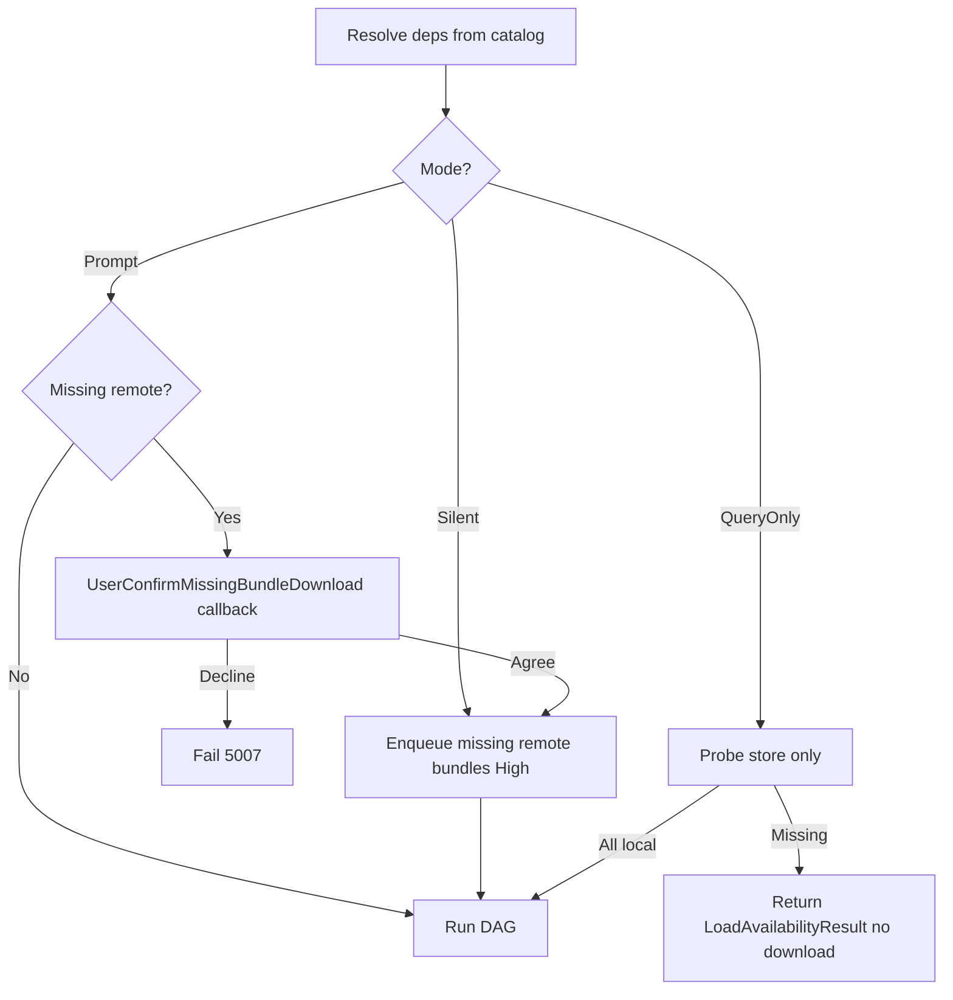

# HyperContent Load & Release Flow

How assets are loaded through the Operation DAG, and how release cascades through ref-counted dependencies.

For architecture overview, see [ARCHITECTURE.md](ARCHITECTURE.md).
For provider execution details, see [PROVIDER_FLOW.md](PROVIDER_FLOW.md).
For RefCount rules, see [CONVENTIONS.md §6](CONVENTIONS.md).

---

## Scope

This document covers:
- Catalog address resolution to ResourceLocation tree
- Operation DAG construction and parallel execution
- OperationCache deduplication and RefCount
- Release cascade and dependency cleanup
- Edge cases: duplicate load, shared dependencies, failure handling

---

## Key Classes

| Class | File | Owner | Responsibility |
|-------|------|-------|---------------|
| `HyperContent` | `Runtime/Operations/HyperContent.cs` | Owner2 | Static facade, LoadAsync / Release entry |
| `HyperContentImpl` | `Runtime/Operations/HyperContentImpl.cs` | Owner2 | Internal implementation |
| `ICatalog` | `Runtime/Catalog/ICatalog.cs` | Owner0 | Address → ResourceLocation resolution |
| `ResourceLocation` | `Runtime/Catalog/ResourceLocation.cs` | Owner0 | Location descriptor with dependencies |
| `ResourceManager` | `Runtime/Operations/ResourceManager.cs` | Owner2 | DAG scheduler: dependency tree + execution |
| `OperationCache` | `Runtime/Operations/OperationCache.cs` | Owner2 | Global Operation cache, RefCount management |
| `AsyncOperationBase` | `Runtime/Operations/AsyncOperationBase.cs` | Owner2 | Operation base: status, RefCount, DAG deps |
| `ContentHandle<T>` | `Runtime/Core/ContentHandle.cs` | Owner0 | Unified handle returned to caller |
| `InstanceRegistry` | `Runtime/Lifecycle/InstanceRegistry.cs` | Owner2 | GameObject instance → Operation tracking |
| `IBundleDownloadQueue` | `Runtime/Core/IBundleDownloadQueue.cs` | Owner0 | Enqueue bundle bytes; single consumer of `IBundleTransport` |
| `BundleDownloadQueue` | `Runtime/Bundle/BundleDownloadQueue.cs` | Owner3 | Default queue: High/Normal/Low + merge by relative path |

---

## 0. Remote bundles & global download queue

Remote bundle bytes are **not** downloaded inside `RemoteBundleProvider` via transport directly. They go through **`IBundleDownloadQueue.Enqueue`** (`BundleDownloadQueue` default):

| Source | Typical priority | Notes |
|--------|------------------|--------|
| `HyperContent.LoadAsync` / scene / instantiate (missing remote bundle) | **High** | Same lane as urgent gameplay loads; can merge with other waiters on the same `RemoteRelativePath`. |
| `DownloadAllUpdatesAsync`, `DownloadBundlesAsync` | **Normal** | Update UI / user-selected batches. |
| `DownloadAllBlockingBundlesAsync` | **High** | Blocking-tagged remote bundles only; aligns with load-driven lane per runtime plan. |
| Future prefetch APIs | **Low** | **Next version** — [TODO.md](TODO.md) § “Low-priority background prefetch”. |

**Global progress (aggregate):** `HyperContent.RegisterDownloadQueueProgressListener` forwards to `IBundleDownloadQueue.RegisterProgressListener`. Callbacks receive `DownloadQueueProgressSnapshot` (completed vs estimated bytes, pending/active logical counts). This is **coarse queue-wide** progress, not the same as a single `LoadAsync` completion percentage.

**Operation-scoped progress (runtime plan §5.2):** Batch **`pOnProgress`** on `DownloadAllUpdatesAsync`, `DownloadAllBlockingBundlesAsync`, `DownloadBundlesAsync` covers **only that batch** — **`BundleDownloadManager` / `BundleDownloadQueue` (Owner3)**. Optional per-`LoadAsync` progress is **not** public yet; see [CONVENTIONS.md §1.5](CONVENTIONS.md).

**Batch cancellation:** Optional **`CancellationToken`** on the same `Download*` facade methods; merge + `DownloadResult.cancelled` + `OPERATION_CANCELLED` — [CONVENTIONS.md §1.6](CONVENTIONS.md).

**Network modes:** `LoadNetworkOptions` / `QueryLoadAvailability` — prompt-before-download runs a **catalog+store preflight** before the DAG starts; declining uses `OPERATION_USER_DECLINED_REMOTE_DOWNLOAD`. See CONVENTIONS §1.3.

---

## 1. Load Flow Overview

The load entry point accepts either a **string address** (GUID or Name per Catalog) or an **AssetReference** (which stores the GUID). Resolving the address to a Location tree is identical in both cases.

Example (string): `HyperContent.LoadAsync<GameObject>("Widget/AvatarWidget")`  
Example (reference): `HyperContent.LoadAsync(_prefabRef)` where `_prefabRef` is `AssetReference<GameObject>`

AvatarWidget depends on AvatarIcon atlas. The dependency set is baked into the Catalog at build time. Under the default **AssetLevel** dependency mode this set is the asset's *own* real dependency bundles (per-asset, narrowed) rather than the owning bundle's full bundle-level closure — see §1.1 below and [CATALOG_SCHEMA.md §2.4](CATALOG_SCHEMA.md).

### Step 1 — Catalog resolves address to Location tree

```
ICatalog.TryGetLocations("Widget/AvatarWidget", typeof(GameObject))

Location tree (flat parallel design):

AvatarWidget asset Location
  ├── InternalId : "AvatarWidget"           ← asset name inside bundle
  ├── ProviderId : "BundleAssetExtractor"   ← extracts asset from loaded bundle
  └── Dependencies:
       ├── AvatarWidget.bundle Location     ← parallel load (1)
       │     ├── ProviderId : "BundleFileProvider"
       │     └── Dependencies: []
       └── AvatarIcon.bundle Location       ← parallel load (2)
             ├── ProviderId : "BundleFileProvider"
             └── Dependencies: []
```

**Key design**: All dependency bundles are **direct children** of the asset Location. Bundles have no chain dependencies. This enables parallel bundle loading — only the final asset extraction waits for all bundles.

### 1.1 Dependency mode (AssetLevel vs BundleLevel)

The **contents** of the `Dependencies` list above are determined by the global `DependencyLoadMode` frozen into `settings.json` at Full Build time (the runtime does not change it via hot-update):

- **AssetLevel** (default) — the list is the asset's *own* real dependency bundles (`AssetRecordEntry.dependencyBundles`, ordered, owning bundle LAST). If `AvatarWidget` does not itself reference `BundleX`, `BundleX` is **not** loaded even when the owning `AvatarWidget.bundle` as a whole depends on it. If the asset record carries **no** asset-level dependency data, the load **fails loudly** with `CATALOG_ASSET_DEPS_MISSING` (1010) instead of silently falling back — see [CONVENTIONS.md §4](CONVENTIONS.md).
- **BundleLevel** (rollback / A-B) — legacy behavior: the list is the owning bundle's full bundle-level transitive closure (`BundleRecordEntry` dependencies).

Build-time computation, the post-order owning-bundle-LAST invariant, and the **SpriteAtlas indirect-dependency recovery** (why a packed Sprite still pins its atlas bundle under AssetLevel) are all specified in [CATALOG_SCHEMA.md §2.4 / §2.4.1](CATALOG_SCHEMA.md).

### Step 2 — ResourceManager builds Operation DAG

ResourceManager walks the Location tree and creates Operations via OperationCache:

```
ResourceManager.LoadAsync(AvatarWidget Location)
  ├─ OperationCache.GetOrCreate → Op-A (AvatarWidget asset)   RefCount=1
  ├─ OperationCache.GetOrCreate → Op-B (AvatarWidget.bundle)  RefCount=1
  └─ OperationCache.GetOrCreate → Op-C (AvatarIcon.bundle)    RefCount=1

DAG:
  [Op-B] AvatarWidget.bundle  ──┐
                                 ├──→ [Op-A] AvatarWidget asset
  [Op-C] AvatarIcon.bundle   ──┘
```

Op-A tracks `PendingDepCount = 2`. Each dependency completion decrements by 1. Op-A executes when count reaches 0.

### Step 3 — Parallel execution

```
(1) Op-B and Op-C enter InProgress simultaneously (no ordering between them)
    Op-B: BundleFileProvider loads AvatarWidget.bundle → Complete
    Op-C: BundleFileProvider loads AvatarIcon.bundle  → Complete

(2) Op-A.PendingDepCount reaches 0 → enters InProgress
    BundleAssetExtractor calls bundle.LoadAssetAsync("AvatarWidget")
    → Op-A.Status = Succeeded

(3) ContentHandle<GameObject>.Completed fires
    User gets handle.Result
```

Performance: parallel `max(T_bundleA, T_bundleB) + T_loadAsset` vs serial `T_bundleA + T_bundleB + T_loadAsset`.

### Step 4 — RefCount state after load

```
Op-A (AvatarWidget asset)    RefCount = 1  ← held by user Handle
Op-B (AvatarWidget.bundle)   RefCount = 1  ← held as Op-A dependency
Op-C (AvatarIcon.bundle)     RefCount = 1  ← held as Op-A dependency
```

---

## 2. Operation State Machine

```
         +----------+
         |   None   |  Initial state
         +----+-----+
              | Created
         +----v-----+
         | Pending  |  Waiting for dependencies
         +----+-----+
              | All deps Succeeded
         +----v------+
         | InProgress|  Provider executing IO
         +----+------+
        +-----+------+
   +----v----+  +----v----+
   |Succeeded|  | Failed  |
   +----+----+  +----+----+  (RefCount > 0: stays in this state)
        +-----+------+
              | RefCount == 0
         +----v-----+
         | Disposed |  Provider.Release + recursive dep release
         +----------+
```

Note: "Alive" is a **conceptual state** (Succeeded/Failed with RefCount > 0), not a literal enum value. `OperationStatus` enum values are: `None`, `Pending`, `InProgress`, `Succeeded`, `Failed`, `Disposed`.

---

## 3. OperationCache

OperationCache guarantees **one Operation per LocationHash** globally.

**GetOrCreate**: If LocationHash exists in cache → RefCount++ and return existing. Otherwise create new Operation with RefCount=1.

**Release**: RefCount--. If reaches 0 → remove from cache → recursively Release all dependency Operations → call `op.Dispose()` (triggers `Provider.Release` for resource cleanup, then sets status to `Disposed`).

This mechanism ensures:
- No duplicate IO for the same resource
- Shared bundles accumulate refs from multiple parent assets
- Bundle unload only happens when ALL dependent assets are released

---

## 4. Release Flow

```
User calls HyperContent.Release(handle)
  │
  ├─ Find Operation via handle.OperationId
  ├─ Invalidate handle (prevents double-release)
  │
  └─ OperationCache.Release(op)
       ├─ RefCount--
       ├─ RefCount > 0 → done (other users still active)
       └─ RefCount == 0:
            ├─ Remove from cache
            ├─ Recursively Release all dependency Operations
            │    └─ Each dep: RefCount--, if 0 → recursive cascade
            └─ op.Dispose() → Provider.Release(handle) → status = Disposed
```

---

## 5. InstantiateAsync & ReleaseInstance

`InstantiateAsync` creates GameObjects that need separate lifecycle tracking:

- `InstantiateAsync(address)` → loads the prefab (RefCount+1) → `Object.Instantiate` → InstanceRegistry tracks `instanceID → Operation`
- `ReleaseInstance(instance)` → InstanceRegistry finds the Operation → `Object.Destroy(instance)` → `Release(op)` (RefCount-1)

Multiple instances from the same prefab share the same underlying Operation. The prefab bundle unloads only when all instances are released.

---

## 6. ContentHandle\<T\>

The handle is the **sole contract** between user and system:

| Role | Description |
|------|-------------|
| Observation | `IsDone`, `IsSuccess`, `Progress`, `Error` |
| Result | `Result` property (valid when `IsDone && IsSuccess`) |
| Release credential | System locates Operation via internal `OperationId` |

Supports three async patterns: `Completed` event callback, `await` (Awaitable), `yield return` (IEnumerator).

All operation types (asset, scene, preload) use the same `ContentHandle<T>` — no separate handle types.

---

## 7. Edge Cases

### 7.1 Duplicate load of same address

```
1st LoadAsync("Widget/AvatarWidget") → Op-A created, RefCount=1
2nd LoadAsync("Widget/AvatarWidget") → Op-A cache-hit, RefCount=2
Release(handle1)                     → RefCount=1, no unload
Release(handle2)                     → RefCount=0, cascade unload
```

### 7.2 Shared dependency across assets

AvatarWidget and HeroWidget both depend on AvatarIcon.bundle:

```
LoadAsync("Widget/AvatarWidget") → Op-C(AvatarIcon.bundle) created, RefCount=1
LoadAsync("Widget/HeroWidget")   → Op-C cache-hit, RefCount=2
Release(avatarHandle)            → Op-C RefCount=1, bundle stays loaded
Release(heroHandle)              → Op-C RefCount=0, bundle unloads
```

### 7.3 Invalid handle protection

Releasing an invalid or already-released handle is a no-op with a warning log. The handle is invalidated immediately on first Release to prevent double-release.

### 7.4 Dependency failure cleanup

When a dependency Operation fails, the parent Operation:
1. Sets own status to Failed
2. Releases all already-succeeded dependency Operations (prevents leaks)
3. Propagates error to ContentHandle

---

## 8. Threading & Safety

- **Main thread only**: All Unity API calls (AssetBundle.Load, Instantiate, etc.) execute on main thread
- **OperationCache**: Designed for main-thread-only access. Background threads require explicit synchronization.
- **Atomic writes**: BundleStore uses write-to-tmp-then-rename to prevent corruption

---

## 9. Load network modes, Blocking batch, and minimal usage (runtime plan §6)

### 9.1 Three modes (`LoadAssetNetworkMode`)

| Mode | Behavior |
|------|----------|
| **Silent** (default when `LoadNetworkOptions` omitted) | Missing remote bundles are enqueued at **High** priority; no user prompt. |
| **PromptBeforeDownload** | Before any download for this load, the runtime computes **`MissingBundlePromptInfo`** (missing **bundle count** + **total bytes** from catalog `BundleInfo.Size` only — **no URLs**). Calls `LoadNetworkOptions.UserConfirmMissingBundleDownload`; **false** → load fails with **`OPERATION_USER_DECLINED_REMOTE_DOWNLOAD`**. |
| **QueryOnly** | No download. Use **`HyperContent.QueryLoadAvailability<T>(address)`** → **`LoadAvailabilityResult`**. If remote deps are missing locally → **`CanCompleteLocally == false`**, typically **`OPERATION_LOAD_QUERY_ONLY_INCOMPLETE`**. |

**State machine (conceptual):**



### 9.2 Blocking vs non-Blocking

- **`DownloadAllBlockingBundlesAsync`** prefetches **Remote + `BundleTagFlags.Blocking`** bundles only ( **High** queue). Call **after** `Initialize` when the in-memory catalog is the one you want. If **`TryUpdateCachedCatalogOnDiskAsync`** ran **before** the first init, that is already true. If it ran **after** init and returned **`Applied`**, call **`ReloadRuntimeCatalogAsync`** first. It is **not** part of Init and does **not** replace on-demand **`LoadAsync`** for non-Blocking remote deps.

### 9.3 Minimal example (probe → optional prompt → load)

Illustrative only — no real UI; marshal prompt to the **main thread** inside the callback if you show dialogs.

```csharp
using com.igg.hypercontent;
using com.igg.hypercontent.runtime;

// 1) Optional: query without downloading (e.g. gate a button)
var probe = HyperContent.QueryLoadAvailability<Texture2D>("UI/Banner");
if (!probe.CanCompleteLocally)
{
    int n = probe.MissingSummary.MissingBundleCount;
    long bytes = probe.MissingSummary.TotalMissingBytes;
    // Show n and bytes only — do not display URLs (see LoadNetworkTypes.cs)
}

// 2) Load with prompt
var opts = new LoadNetworkOptions
{
    Mode = LoadAssetNetworkMode.PromptBeforeDownload,
    UserConfirmMissingBundleDownload = info => true // replace with real UI: return user agreed
};
var handle = HyperContent.LoadAsync<Texture2D>("UI/Banner", opts);
// await handle; HyperContent.Release(handle);
```

---

## Related Docs

- [ARCHITECTURE.md](ARCHITECTURE.md) — Layered architecture and design principles
- [PROVIDER_FLOW.md](PROVIDER_FLOW.md) — What happens inside each Provider's `Provide()` call
- [CONVENTIONS.md](CONVENTIONS.md) — RefCount rules (§6), error codes (§4), download progress channels (§1.5)
- [CATALOG_SCHEMA.md](CATALOG_SCHEMA.md) — How catalog data maps to ResourceLocation
